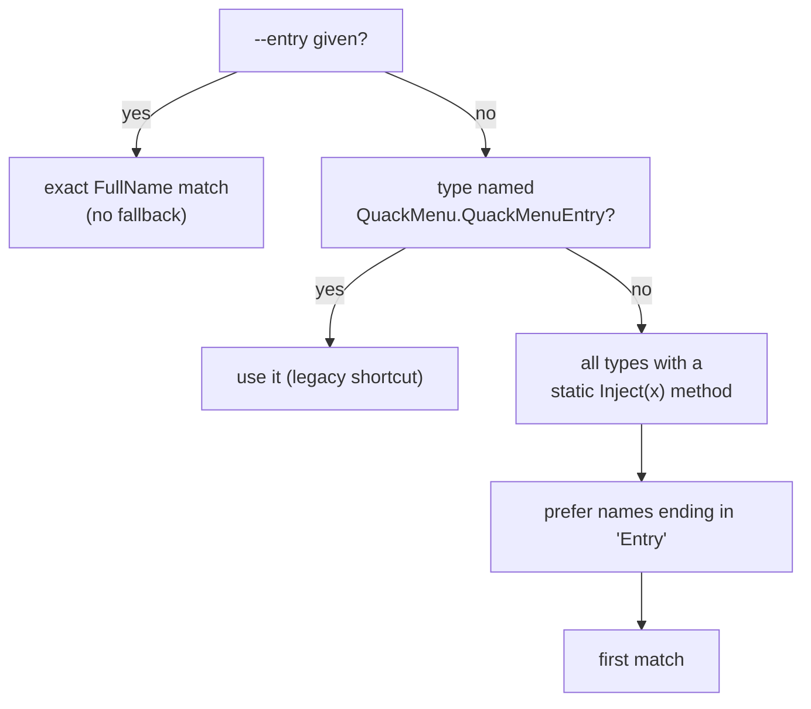
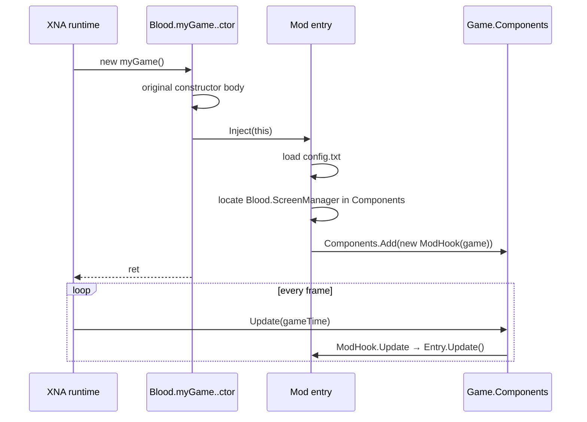

# Injection pipeline

`meatymod inject` is the only part of MeatyMod that modifies an executable. This page documents precisely what it changes, so you can audit it before trusting it.

## The patch, in one sentence

For each mod DLL, the injector appends `ldarg.0` + `call <Mod>.Inject(Game)` immediately **before the final `ret`** of `Blood.myGame`'s instance constructor — nothing else in the assembly is touched.

## Step by step

`MeatyMod.Injector.AssemblyInjector.Patch` performs the following, in order:

1. **Validate inputs.** The game executable must exist, `modDllPaths.Length` must equal `entryTypeNames.Length`, and every mod DLL must exist. Otherwise `FileNotFoundException` / `ArgumentException`.
2. **Back up.** `File.Copy(exePath, backupPath, overwrite: true)`. The command passes `outputPath + ".backup"`.
3. **Decide the write target.** If `outputPath` resolves to the same file as `exePath`, Cecil writes to `outputPath + ".tmp" + <guid>` first, because a module cannot be written over the file it was read from. The temp file is copied over the target and deleted in a `finally` block.
4. **Read the module** with `ModuleDefinition.ReadModule(exePath)`.
5. **Find the host type** — `gameModule.Types.FirstOrDefault(t => t.FullName == "Blood.myGame")`. Missing ⇒ `InvalidOperationException("Blood.myGame type not found in game assembly.")`.
6. **Find the host method** — the first non-static constructor of that type. Missing ⇒ `"Blood.myGame instance constructor not found."`.
7. **Find the anchor** — the *last* `OpCodes.Ret` in the constructor body. Missing ⇒ `"No ret instruction found in constructor."`.
8. **For each mod DLL**, read it as a module, [resolve the entry type](#entry-type-resolution), find a method matching `IsStatic && Name == "Inject" && Parameters.Count == 1`, import it into the game module and insert two instructions before the anchor:

   ```text
   IL_xxxx: ldarg.0            // the myGame instance (a Microsoft.Xna.Framework.Game)
   IL_xxxx: call   void [Mod]Namespace.Entry::Inject(class [Microsoft.Xna.Framework.Game]…Game)
   ```

9. **Write** the patched module and return `true`.

Because every insertion happens *before the same anchor instruction*, calls end up in the order the `--mod` flags were given.

## Entry type resolution

`ResolveEntryType(modModule, entryTypeName)`:



Consequences worth knowing:

- `--entry` is **strict**. A typo produces `Mod entry type not found: <name>` rather than silently auto-detecting.
- Auto-detection only considers *arity*, not parameter type. A `static void Inject(string)` would be selected and then fail at runtime, so keep the signature `static void Inject(Game game)`.
- `OrderByDescending(t => t.Name.EndsWith("Entry"))` is a stable sort on a boolean: among several candidates, `…Entry` types win, otherwise module order decides. Ship exactly one entry type per DLL if you want determinism.

## What the command does around the patch

`InjectCommand` adds the deployment step that `AssemblyInjector` deliberately leaves out:

1. Parses arguments in two modes — legacy positional (`inject <exe> <dll> [out] [--entry T]`) and flagged (`--mod <dll> [--entry T]` repeated). See [`inject`](../cli/inject.md#argument-forms).
2. `outputPath` = the last positional argument if there are two or more, otherwise the executable itself (in-place patch).
3. `backupPath` = `outputPath + ".backup"`.
4. After patching, for each DLL:
   - copies the DLL next to the output executable, skipping duplicate file names with a warning;
   - walks five directories up from the DLL (`bin\<cfg>\<tfm>` → `src\<Mod>` → mod root) looking for `config.txt`;
   - if found, copies it to `<outputDir>\<ModName>.txt` **and** `<outputDir>\Content\<ModName>\config.txt` — the two locations the example mods probe at startup.

```text
game\Blood and Bacon\
├─ BloodandBacon.exe           ← patched
├─ BloodandBacon.exe.backup    ← pristine copy
├─ Oink.dll
├─ Oink.txt                    ← copy of mods\Oink\config.txt
└─ Content\Oink\config.txt     ← preferred location, probed first
```

## Runtime sequence



The constructor runs **before** XNA's `Initialize`/`LoadContent`, so at `Inject` time `Game.Components` may be empty and content cannot be loaded yet. That is why both example mods register a `GameComponent` and do their real work from `Update`, re-resolving the screen manager until it appears.

## Failure modes

| Message | Cause |
| --- | --- |
| `Game executable not found.` | bad path to the exe |
| `Mod DLL not found.` | bad `--mod` path |
| `Blood.myGame type not found in game assembly.` | not a Blood & Bacon executable, or an obfuscated/packed build |
| `Blood.myGame instance constructor not found.` | unexpected game build |
| `No ret instruction found in constructor.` | unexpected IL shape |
| `No mod entry type found in mod DLL: <path>` | no type exposes a static one-argument `Inject` |
| `Mod entry type not found: <name>` | `--entry` does not match any `FullName` |
| `<Type>.Inject(Game) method not found in mod DLL.` | the chosen type has no suitable `Inject` |

All of them surface as `Inject failed: <message>` with exit code `1`, and the backup written in step 2 is already on disk.

## Auditing a patched executable

```bat
:: byte-level diff of patched vs backup
fc /b "game\Blood and Bacon\BloodandBacon.exe" "game\Blood and Bacon\BloodandBacon.exe.backup"

:: prove the mod really executes, without launching the game
tools\modharness\bin\Release\net10.0-windows\ModHarness.exe

:: prove the DLL is loaded in the live process
tools\memscan\bin\Release\net10.0\memscan.exe BloodandBacon --find-module Oink.dll
```

See [ModHarness](../tools/modharness.md) and [memscan](../tools/memscan.md).

## Re-injecting

Injecting twice *without restoring first* patches the already-patched executable and appends a second call — the mod's `Inject` guards against double-initialisation with a static `_injected` flag, but the backup now contains a patched file. Always `restore` before re-injecting; the `run.bat` scripts do this for you.
