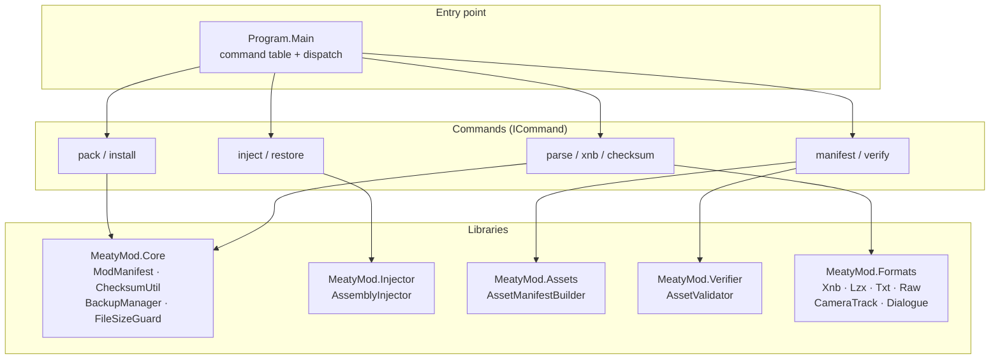
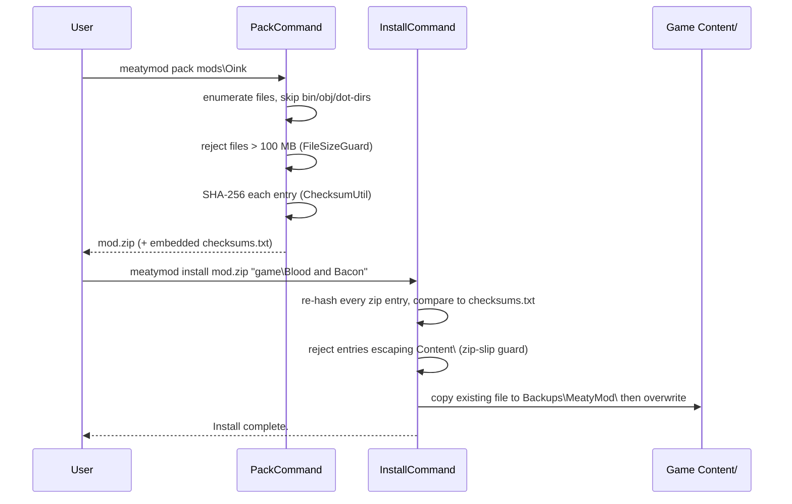
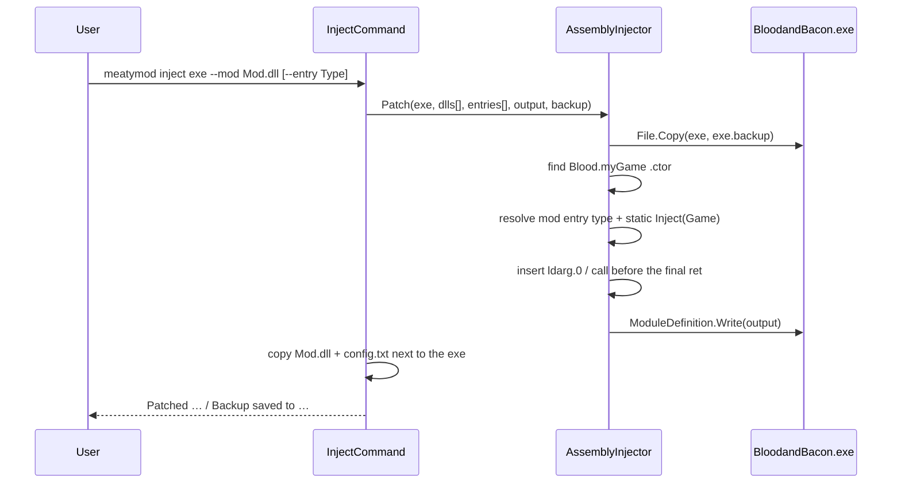

# Architecture overview

MeatyMod is a thin command-line front end over four independent leaf libraries plus an injector. There is no plugin host, no service container and no runtime discovery: `Program.Main` owns a static list of commands, and each command calls directly into the library it needs.

## Layers



Design rules that the code actually follows:

- **Commands own all I/O and all user-facing text.** Libraries never write to the console; they return values or throw.
- **Libraries are stateless.** Every public API in `Core`, `Formats`, `Assets` and `Verifier` is either a static method or a short-lived object constructed from a path.
- **Exit codes, not exceptions, cross the process boundary.** Each `ICommand.Run` catches, prints to `stderr`, and returns `1`.
- **Nothing is discovered at runtime.** Adding a command means editing the list in `Program.Main`.

## Dispatch

`MeatyMod.Cli.Program` builds the command list, matches `args[0]` against `ICommand.Name`, forwards the remaining arguments and returns the command's exit code.

```csharp
var commands = new List<ICommand>
{
    new PackCommand(), new InstallCommand(), new InjectCommand(),
    new RestoreCommand(), new ManifestCommand(), new VerifyCommand(),
    new ParseCommand(), new XnbCommand(), new ChecksumCommand(),
};

var command = commands.Find(c => c.Name == args[0]);
if (command == null) { PrintUsage(commands); return 1; }

return command.Run(rest);
```

Unknown command, or no arguments at all, prints the usage block and returns `1`.

## The two data flows

### Content pipeline



### Code pipeline



## Project responsibilities

| Project | Owns | Never does |
| --- | --- | --- |
| `MeatyMod.Cli` | argument parsing, console output, exit codes | file-format logic |
| `MeatyMod.Core` | manifest model + validation, SHA-256, backup root containment, 100 MB guard | console output |
| `MeatyMod.Formats` | XNB header + LZX decompression, TXT/RAW/camera/dialogue parsing | validation policy |
| `MeatyMod.Verifier` | "is this a real XNB" header check, directory tallies | decompression |
| `MeatyMod.Assets` | basename → path index of a `Content` tree | reading file contents |
| `MeatyMod.Injector` | Mono.Cecil module rewriting and entry-type resolution | copying mod payloads (the command does that) |

## Error-handling contract

Every command follows the same shape:

```csharp
public int Run(string[] args)
{
    if (/* missing args */) { Console.Error.WriteLine("Usage: …"); return 1; }
    if (/* missing path */) { Console.Error.WriteLine($"… not found: {path}"); return 1; }

    try   { /* work */ return 0; }
    catch (Exception ex) { Console.Error.WriteLine($"… failed: {ex.Message}"); return 1; }
}
```

`verify` additionally returns `1` when the content is *valid XNB but not all of it* — exit code means "the check failed", not "the tool crashed". The full table is in the [CLI overview](../cli/overview.md#exit-codes).

## Deliberate limitations

- The injector looks for the literal type name `Blood.myGame`; it is Blood & Bacon specific by design.
- Mods are not isolated, versioned against each other, or dependency-resolved. Multi-mod injection is simply several `call` instructions appended in argument order.
- There is no uninstall for content mods beyond the per-file copies in `Backups\MeatyMod\`.
- `AssetManifestBuilder` keys by file basename, so duplicate basenames in different folders collapse to the last one enumerated.
