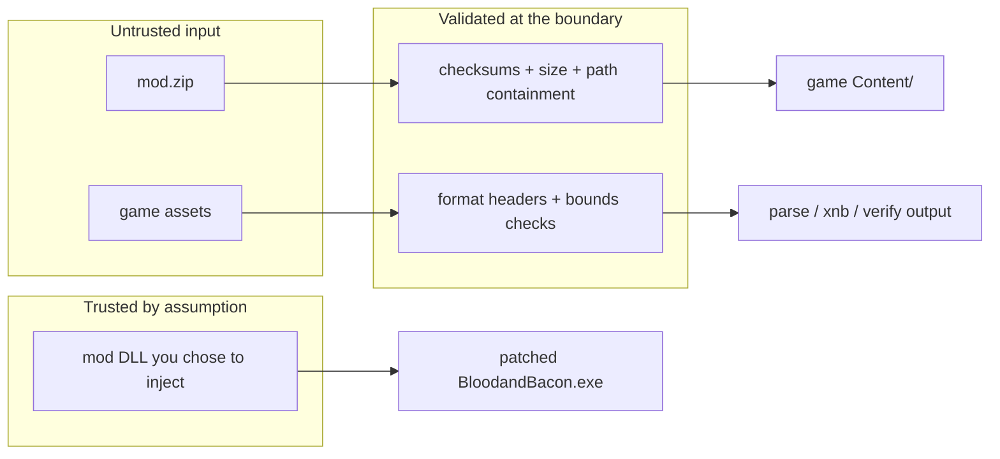

# Security model

MeatyMod makes one blunt assumption: **the user chose the mod, so the mod is trusted.** Everything it defends against is accidental damage and malformed input — not a hostile mod author.

## The threat MeatyMod does not address

> As it sounds, only add mods YOU TRUST. I will not add a whole ass script for detecting if it will execute MEMZ or any other BS. **PLEASE** check your mods.
>
> — `README.md`

A mod DLL runs in the game process with your user account's full rights. It can read and write your files, open sockets, and start processes. MeatyMod does not sandbox, sign, scan or permission-check anything.

**Mitigations that are actually yours to apply:**

- read the mod's source, or only inject mods you built;
- keep `game\` as a copy rather than the live Steam install while testing;
- run [`memscan`](../tools/memscan.md) against a running game to see what actually loaded;
- `meatymod checksum` a mod directory before and after you receive an update.

## Guards that are implemented

### Path containment on install (zip-slip)

`InstallCommand` resolves every entry against the content root and refuses anything that escapes it:

```csharp
var targetPath = Path.GetFullPath(Path.Combine(contentRoot, entry.FullName));

if (!IsInside(contentRoot, targetPath))
{
    Console.Error.WriteLine($"Skipping unsafe entry: {entry.FullName}");
    continue;
}
```

`IsInside` compares against `contentRoot` plus a trailing separator (case-insensitively), so `..\..\Windows\System32\x.dll` and absolute paths are both skipped rather than written. Unsafe entries are skipped individually; the rest of the install continues.

:::caution This is a lexical check only
`Path.GetFullPath` normalises a path **as a string**. It collapses `..`, `.` and mixed separators; it does not ask the filesystem anything. So the guard stops the classic zip-slip entry and nothing more:

- **Reparse points are not followed.** If `Content\` — or any directory beneath it — is a symlink, junction or mount point, the resolved path still looks like it is inside the root, and the write lands wherever the link points. Nothing calls `File.ResolveLinkTarget` or checks `FileAttributes.ReparsePoint`.
- **The comparison is `OrdinalIgnoreCase` regardless of the filesystem.** That matches NTFS, the only platform the game runs on. On a case-sensitive filesystem it is too permissive: with a content root of `…/Game/Content`, an entry resolving into a genuinely different sibling directory `…/Game/content` compares equal and is accepted.

Both gaps are known and untracked by tests. On the supported Windows target the practical exposure is small, but do not read this guard as a sandbox — the mod DLL you inject has your full user rights anyway.
:::

### Path containment on backup

`BackupManager.ResolveBackupPath` applies the same idea in reverse and throws instead of skipping:

```csharp
if (!destPath.StartsWith(rootPrefix, StringComparison.OrdinalIgnoreCase))
{
    throw new ArgumentException($"Path resolves outside backup root: {relativePath}");
}
```

The same two caveats apply: it is a string comparison, case-insensitive on every platform, and blind to reparse points.

### Integrity verification on install

`pack` embeds `checksums.txt` (`<relative/path>  <sha256>` per line). `install` re-hashes every listed entry **before writing anything**:

```csharp
var checksumErrors = VerifyChecksums(archive);
if (checksumErrors.Count > 0)
{
    Console.Error.WriteLine("Install aborted: mod integrity check failed.");
    foreach (var error in checksumErrors) { Console.Error.WriteLine($"  {error}"); }
    return 1;
}
```

Reported conditions: `checksum mismatch: <path> (expected …, got …)`, a listed file missing from the archive, and `checksums.txt: malformed line: "…"`.

:::caution This detects corruption, not forgery
`checksums.txt` lives *inside* the archive it describes. Anyone who can modify the zip can recompute the hashes. It proves the archive is internally consistent — nothing more. There is no signing.
:::

An archive **without** `checksums.txt` installs with no verification at all (`VerifyChecksums` returns an empty error list when the entry is absent).

### Size guard

`MeatyMod.Core.FileSizeGuard` caps single files at 100 MiB (`DefaultMaxBytes = 100L * 1024 * 1024`):

- `pack` skips oversized source files — `Skipping oversized file: <relPath>`;
- `install` skips oversized zip entries by their declared `entry.Length` — `Skipping oversized entry: <name>`.

This bounds accidental zip bombs and stray build artefacts. `IsAllowed(length, maxBytes)` treats a non-positive `maxBytes` as "use the default", so the guard cannot be disabled by passing `0`.

### Hygiene filters in `pack`

Entries are skipped when any path segment is `bin` or `obj` (case-insensitive) or starts with `.` — build output, `.git`, `.vs` and friends never reach the archive.

### Manifest validation

`ModManifest.Validate()` enforces a conservative identifier grammar before anything is written:

| Field | Rule |
| --- | --- |
| `Id` | required, matches `^[A-Za-z0-9_.-]+$` — no spaces, no slashes, so an id can never become a path traversal |
| `Name` | required, non-blank |
| `Version` | required, parses with `System.Version` |
| `Author` | required, non-blank |
| `Replaces` | must not be null |

`ModManifestLoader.Load` returns `null` on any parse failure instead of throwing; `LoadWithValidation` returns the error list.

### Analyzer suppressions are explicit

Where the code steps outside a security analyzer's comfort zone, it says why in-line — for example in `InstallCommand`:

```csharp
#pragma warning disable CA5389 // entry.FullName is containment-validated against contentRoot above.
```

Keep that style: a suppression without a justification comment is a review failure.

## Trust boundaries



Parsers are defensive about *malformed* data — `XnbContentReader` rejects a bad magic, an unsupported version, negative lengths and a decompressed size that does not match; `RawReader` refuses a file shorter than `width * height * 2`; `TxtDocument` returns defaults for out-of-range indices instead of throwing. None of that is a defence against a hostile DLL.

## Reporting a problem

Open an issue at [github.com/havaianasdestruido/MeatyMod/issues](https://github.com/havaianasdestruido/MeatyMod/issues). If the issue is a vulnerability in MeatyMod itself (a path-containment bypass, for example) rather than in a third-party mod, say so in the title and avoid posting a working exploit payload.
