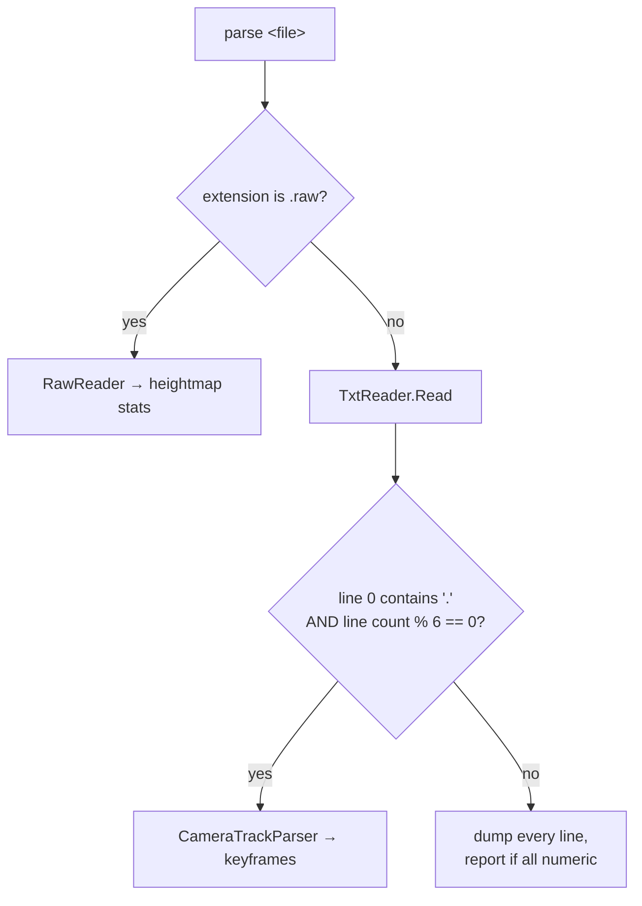

# `meatymod parse`

Parses a loose game asset and prints a summary. The format is chosen from the extension and the content shape.

```text
meatymod parse <file>
```

## Dispatch



The heuristic is intentionally simple — a camera track is a flat list of floats in groups of six, so "there is a decimal point and the count divides by six" is a good enough signal. Anything else is treated as a generic line-oriented TXT asset.

## TXT assets (day files, configs, dialogue)

```bat
meatymod parse "game\Blood and Bacon\Content\day1.txt"
```

```text
Lines: 12
0: 3
1: 1
2: 450
…
All values numeric: True
```

Blank lines are dropped and every line is trimmed before indexing, which mirrors how the game reads these files positionally. `All values numeric: True` is printed only when every line parses as `int` or `float`.

## Camera tracks

```bat
meatymod parse "game\Blood and Bacon\Content\camera_intro.txt"
```

```text
Camera keyframes: 48
Pos(12.5, 3.25, -40) Target(0, 2, 0)
Pos(12.1, 3.25, -38.4) Target(0, 2, 0)
Pos(11.7, 3.26, -36.8) Target(0, 2, 0)
```

The first three keyframes are shown. Each keyframe is six consecutive floats: position XYZ then target XYZ, parsed with `CultureInfo.InvariantCulture`. A trailing partial group is discarded.

## RAW heightmaps

```bat
meatymod parse "game\Blood and Bacon\Content\terrain\heights.raw"
```

```text
Width: 2048
Height: 2048
SampleCount: 4194304
MinHeight: 0
MaxHeight: 61440
```

Dimensions come from `RawReader.TryGuessDimensions`, which tests the sample count against the squares of 512, 1024, 2000, 2048 and 4096 and then against those as one side of a rectangle. If nothing matches, it falls back to 2048 × 2048 — and `RawReader.Read` throws if the file is too short for that, surfacing as:

```text
Parse failed: File is too short for a 2048x2048 heightmap: 1048576 bytes, expected at least 8388608.
```

Samples are little-endian `ushort`.

## Exit codes

| Code | When |
| --- | --- |
| `0` | parsed and printed |
| `1` | no argument, file not found, or `Parse failed: <message>` |

## Limitations

- XNB files are **not** handled here — use [`xnb`](./xnb.md).
- Dialogue assets fall into the generic TXT branch; `DialogueParser` exists as a library API ([`MeatyMod.Formats`](../api/meatymod-formats.md#dialogueparser)) but `parse` does not special-case it, because its output is identical to the trimmed line dump.
- The heightmap summary reports min/max only; there is no export.

## Related

- [TXT format](../formats/txt.md) · [RAW format](../formats/raw.md)
- [`MeatyMod.Formats` API](../api/meatymod-formats.md)
