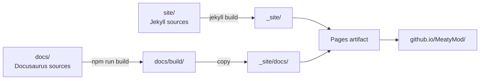

# Documentation site

The published site is **two static sites stitched into one deployment**:

| Path | Generator | Source |
| --- | --- | --- |
| `/MeatyMod/` | Jekyll | `site/` |
| `/MeatyMod/docs/` | Docusaurus 3 | `docs/` |

Jekyll owns the landing experience — hero, feature summary, mod cards, download links. Docusaurus owns everything reference-shaped: search, sidebar, versionable technical pages. Neither knows about the other; they are merged at deploy time by copying the Docusaurus build into `_site/docs/`.



## Working on the Jekyll site

```bash
cd site
bundle install
bundle exec jekyll serve --livereload
# http://127.0.0.1:4000/MeatyMod/
```

| File | Purpose |
| --- | --- |
| `_config.yml` | title, description, `baseurl: /MeatyMod`, nav, plugins |
| `_layouts/default.html` | shell: head, header, footer |
| `_layouts/page.html` | inner pages |
| `_includes/` | `head.html`, `header.html`, `footer.html` |
| `assets/css/main.css` | the whole theme — plain CSS, no preprocessor, no framework |
| `assets/img/` | logo, favicon, social card |
| `index.html`, `install.md`, `mods.md`, `cli.md`, `404.html` | pages |
| `Gemfile` | Jekyll 4.3 plus the two plugins |

There is **no theme gem** — the layouts are local, so what you see in the repository is what renders. Plugins are limited to `jekyll-seo-tag` and `jekyll-sitemap`, both supported by GitHub Pages.

Links must go through `relative_url` so the `/MeatyMod` prefix is applied:

```liquid
<a href="{{ '/mods/' | relative_url }}">Mods</a>
<a href="{{ site.docs_url | relative_url }}">Documentation</a>
```

`site.docs_url` is defined in `_config.yml` as `/docs/`; passing it through `relative_url` yields `/MeatyMod/docs/`.

## Working on the Docusaurus site

```bash
cd docs
npm install
npm start          # http://localhost:3000/MeatyMod/docs/
npm run build      # production build into docs/build
npm run serve      # serve the production build
npm run typecheck  # tsc over the config and sidebars
```

| File | Purpose |
| --- | --- |
| `docusaurus.config.ts` | `url`, `baseUrl: /MeatyMod/docs/`, navbar, footer, Prism, Mermaid |
| `sidebars.ts` | the hand-maintained sidebar — new pages must be added here |
| `docs/**/*.md` | the content you are reading |
| `src/css/custom.css` | theme overrides matching the Jekyll site |
| `static/img/` | logo, favicon, social card |

Configuration decisions worth knowing:

- `routeBasePath: '/'` — docs are served at the sub-site root, so `intro.md` (with `slug: /`) is `/MeatyMod/docs/`.
- `blog: false`, `pages: false` — the landing page is Jekyll's job.
- `onBrokenLinks: 'throw'` and `markdown.hooks.onBrokenMarkdownLinks: 'throw'` — a dead internal link fails the build.
- `themes: ['@docusaurus/theme-mermaid']` with `markdown.mermaid: true` for the diagrams.
- the navbar logo and the "Main site" item link back to the Jekyll landing page. They use the **absolute** URL (`mainSiteUrl`), because Docusaurus rewrites root-relative hrefs against its own `baseUrl` and would turn `/MeatyMod/` into `/MeatyMod/docs/MeatyMod/`.

### Adding a page

1. create `docs/docs/<section>/<name>.md` with front matter (`id`, `title`, `sidebar_label`, `description`);
2. add its id to the right category in `docs/sidebars.ts`;
3. link to it from a related page — orphan pages are easy to lose;
4. run `npm run build` to prove no link is broken.

Relative links between docs include the `.md` extension (`../cli/pack.md`); Docusaurus resolves them at build time and validates them.

## Deployment

`.github/workflows/docs.yml` runs on pushes to `main` that touch `site/`, `docs/` or the workflow itself, and can be dispatched manually.

```text
build:
  actions/checkout (fetch-depth 0 — Docusaurus reads git for "last updated")
  ruby/setup-ruby (bundler-cache, working-directory site)
  bundle exec jekyll build  →  _site/
  actions/setup-node 20 + npm ci + npm run build  →  docs/build/
  copy docs/build  →  _site/docs/
  actions/upload-pages-artifact (_site)

deploy:
  actions/deploy-pages   (only on push to main)
```

Pull requests run the **build** job only, so a broken link or a Liquid error is caught before merge.

:::note Enable Pages once
In the repository settings, set *Pages → Build and deployment → Source* to **GitHub Actions**. Without that, the deploy job fails with a permissions error on its first run.
:::

### Changing the base URL

Three places must agree:

| Where | Value |
| --- | --- |
| `site/_config.yml` | `baseurl: "/MeatyMod"` (and `docs_url: "/docs/"`, which is relative to it) |
| `docs/docusaurus.config.ts` | `baseUrl: '/MeatyMod/docs/'` |
| `docs/docusaurus.config.ts` | `organizationName` / `projectName`, from which `mainSiteUrl` is derived for the navbar logo and the "Main site" link |

For a custom domain, set `baseurl: ""` and `baseUrl: '/docs/'`, add `site/CNAME`, and point DNS at GitHub Pages.

## Local preview of the combined site

```bash
cd site && bundle exec jekyll build --destination ../_site
cd ../docs && npm run build && cp -r build ../_site/docs
cd .. && python3 -m http.server --directory _site 8080
# http://localhost:8080/   (note: baseurl-prefixed links expect /MeatyMod/)
```

Serving the artifact from a parent directory named `MeatyMod` reproduces the production paths exactly.

:::note Extensionless links in the local preview
With `trailingSlash: false`, Docusaurus emits `docs/cli/overview.html` and links to `/MeatyMod/docs/cli/overview`. GitHub Pages resolves that automatically; `python3 -m http.server` does not, so expect 404s on doc links in this particular preview. Use `npm run serve` inside `docs/` to click through the documentation itself.
:::

## Ignored output

`_site/`, `docs/build/`, `docs/.docusaurus/`, `docs/node_modules/` and `site/.jekyll-cache/` are git-ignored. Never commit built output.

`site/Gemfile.lock` is **not** ignored — commit it when you regenerate it, so CI resolves the same gem versions you tested with.
