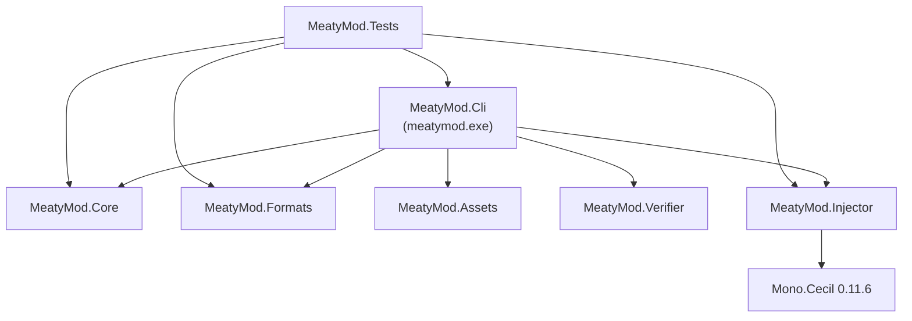

# Repository layout

```text
MeatyMod/
├─ all.bat                     one-shot Release build of everything
├─ manifest.schema.json        JSON Schema (draft-07) for mod manifests
├─ Directory.Build.props       shared MSBuild properties for every suite project
├─ .editorconfig               formatting + analyzer severities
├─ README.md
├─ THIRD_PARTY_NOTICES.md
│
├─ src/                        the suite (net10.0)
│  ├─ MeatyMod.sln
│  ├─ MeatyMod.Cli/            `meatymod` executable
│  │  ├─ Program.cs            command table + dispatch
│  │  └─ Commands/             one file per command, all implement ICommand
│  ├─ MeatyMod.Core/           manifest, checksum, backup, size-guard, version
│  ├─ MeatyMod.Formats/        XNB / LZX / TXT / RAW / camera / dialogue
│  ├─ MeatyMod.Assets/         AssetManifestBuilder
│  ├─ MeatyMod.Verifier/       AssetValidator
│  ├─ MeatyMod.Injector/       Mono.Cecil IL patching
│  ├─ MeatyMod.Tests/          xUnit suite (+ Fixtures/darkFog3_0.xnb)
│  └─ MeatyMod.Assets.json     sample asset manifest output
│
├─ mods/                       example mods (net40 + XNA 4.0)
│  ├─ Oink/
│  │  ├─ manifest.json config.txt build.bat run.bat
│  │  ├─ lib/xna/              vendored XNA reference assemblies
│  │  └─ src/Oink/*.cs
│  ├─ QuackMenu/               same shape as Oink
│  └─ launch/                  launch-oink.bat, launch-quackmenu.bat, launch-both.bat
│
├─ tools/
│  ├─ modharness/              headless proof that an injected mod runs
│  ├─ memscan/                 live-process module + marker scanner
│  ├─ release.ps1              build + stage + checksum + zip into dist\
│  └─ smoke.ps1                post-install game smoke suite
│
├─ site/                       Jekyll marketing site  →  /MeatyMod/
├─ docs/                       Docusaurus docs site   →  /MeatyMod/docs/
├─ .github/workflows/          CI: builds and deploys both sites
│
├─ .ai/                        internal planning / QA / research notes (not published)
└─ game/                       your local game copy — git-ignored, read-only
```

## The `src` solution

`src\MeatyMod.sln` contains seven projects. Dependencies flow one way:



`Core`, `Formats`, `Assets` and `Verifier` have **no** package references and no dependencies on each other — they are leaf libraries. `Mono.Cecil` is the only third-party runtime dependency of the shipped tool.

## Shared build configuration

`Directory.Build.props` applies to every project under the repository root:

| Property | Value |
| --- | --- |
| `TargetFramework` | `net10.0` |
| `ImplicitUsings` / `Nullable` | `enable` |
| `LangVersion` | `latest` |
| `AnalysisLevel` / `AnalysisMode` | `latest` / `All` |
| `EnableNETAnalyzers`, `EnforceCodeStyleInBuild` | `true` |
| `TreatWarningsAsErrors` | `false` |
| `InvariantGlobalization` | `true` |

Individual projects override what they must: `MeatyMod.Cli` and `MeatyMod.Injector` disable implicit usings and nullable (`ImplicitUsings=disable`, `Nullable=disable`), the mods override `TargetFramework` to `net40` with `LangVersion 7.3`, and `ModHarness` forces `PlatformTarget=x86` because XNA 4.0 is x86-only.

## Which folders are git-ignored

```text
game/        your game copy
mod.zip      default pack output
bin/ obj/    build output
dist/        release artifacts
*.log        mod + tool logs
unfriendly.txt   crash log
_site/ docs/build/ docs/node_modules/   generated documentation output
```

## The `.ai` folder

`.ai/` holds the project's internal engineering notes — phase plans, QA registries, maintenance logs and the reverse-engineering research that the mods are built on (`.ai/report/MODDING.MD` in particular). It is **not** published to the documentation site; treat it as the working notebook behind these docs.
