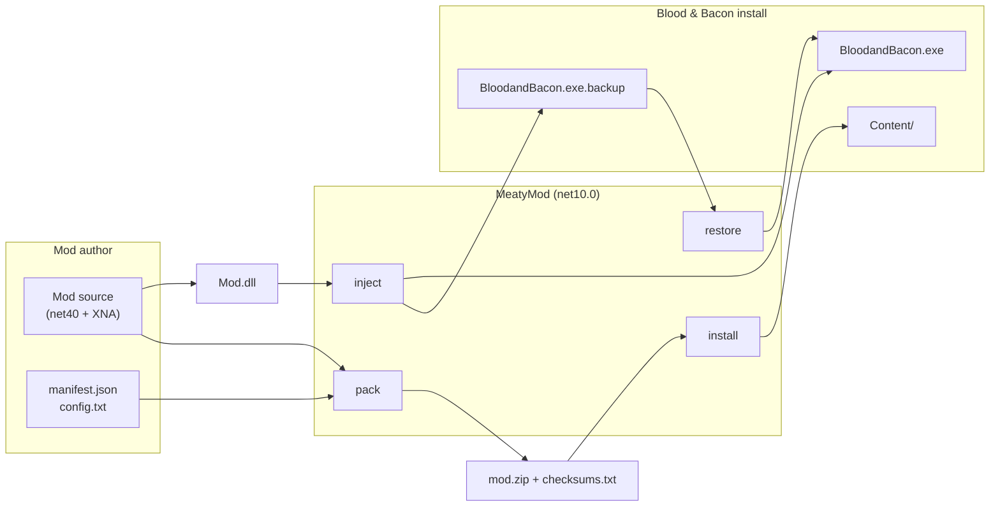

# MeatyMod

MeatyMod is a C# / .NET mod suite for **Blood & Bacon** (XNA 4.0, Steam app 434570). It

- packs mod directories into verifiable zip archives,
- installs content mods into the game's `Content` folder,
- injects .NET mod DLLs into the game executable through Mono.Cecil IL patching,
- parses the game's XNB / TXT / RAW asset formats,
- verifies assets and restores a patched executable back to its original bytes.

Two example mods ship with the repository — **QuackMenu** (creative mode + boss spawner) and **Oink** (pig skin + speed) — both targeting .NET Framework 4.0 and XNA 4.0.

:::danger Only inject mods you trust

`meatymod inject` rewrites the game executable so that it calls code from a third-party DLL on startup. That DLL runs with your user's full privileges — it is not sandboxed, scanned or validated in any way. MeatyMod deliberately ships **no** malware heuristics.

**Read the mod's source before you inject it.** If something goes wrong, `meatymod restore "…\BloodandBacon.exe"` puts the original executable back from the `.backup` file written at inject time.

:::

## How the pieces fit together

There are two distinct distribution paths and it matters which one a mod uses:

| Path | Command | What it touches | Reversible by |
| --- | --- | --- | --- |
| Content mod | `pack` → `install` | files under `game\Blood and Bacon\Content\` | per-file copies under `Backups\MeatyMod\` |
| Code mod | build → `inject` | `BloodandBacon.exe` IL | `restore` from `BloodandBacon.exe.backup` |

## What's in the repository

| Project | Purpose |
| --- | --- |
| [`MeatyMod.Cli`](./api/meatymod-cli.md) | the `meatymod` executable and its nine commands |
| [`MeatyMod.Core`](./api/meatymod-core.md) | manifests, checksums, backups, size guards, version constant |
| [`MeatyMod.Formats`](./api/meatymod-formats.md) | XNB (incl. LZX decompression), TXT, RAW, camera-track and dialogue parsers |
| [`MeatyMod.Assets`](./api/meatymod-assets.md) | asset manifest builder |
| [`MeatyMod.Verifier`](./api/meatymod-verifier.md) | XNB header validation |
| [`MeatyMod.Injector`](./api/meatymod-injector.md) | Mono.Cecil IL patching and mod entry-point discovery |
| `MeatyMod.Tests` | xUnit suite — see [Testing](./development/testing.md) |

Plus [two example mods](./mods/overview.md), [two QA tools](./tools/overview.md) (`modharness`, `memscan`) and a set of batch/PowerShell [scripts](./tools/overview.md#repository-scripts).

## Where to go next

| If you want to… | Read |
| --- | --- |
| build the suite and run your first inject | [Installation](./getting-started/installation.md) → [Quickstart](./getting-started/quickstart.md) |
| understand the IL patch | [Injection pipeline](./architecture/injection-pipeline.md) |
| look up a command | [CLI reference](./cli/overview.md) |
| call the libraries from your own code | [API reference](./api/overview.md) |
| write your own mod | [Authoring a mod](./mods/authoring-a-mod.md) |
| decode game assets | [File formats](./formats/overview.md) |
| fix something that broke | [Troubleshooting](./reference/troubleshooting.md) |

## Status and scope

- Version: `1.0.0` (`MeatyMod.Core.VersionInfo.Version`).
- Suite targets **.NET 10**; mods target **.NET Framework 4.0 / XNA 4.0** because that is what the game loads.
- The injector is hard-wired to Blood & Bacon's `Blood.myGame` type — it is not a general-purpose XNA loader.
- `game\` is expected to be a local, read-only copy of the installed game and is git-ignored.
