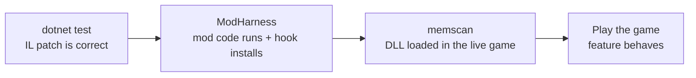

# ModHarness

`tools\modharness` proves that `Oink.OinkEntry.Inject(Game)` really executes and really installs its hook — **without launching the game**.

It loads `Oink.dll` plus the XNA assemblies by reflection, builds a dynamic `ShimGame` subclass of `Microsoft.Xna.Framework.Game`, invokes `Inject`, and then verifies that the hook was installed and runs. The game executable is never started; the only contact with `game\` is a single read-only `File.Exists` check.

## Build and run

```bat
dotnet build tools\modharness\ModHarness.csproj -c Release
tools\modharness\bin\Release\net10.0-windows\ModHarness.exe
```

Exit code `0` means zero FAILs; non-zero means at least one check failed.

## Why the project looks the way it does

| Setting | Reason |
| --- | --- |
| `PlatformTarget=x86` | XNA 4.0 assemblies are x86-only, so the harness must be too |
| `TargetFramework=net10.0-windows` | needs Windows APIs; output under `bin\Release\net10.0-windows\` |
| `UseWindowsForms=true` | XNA's `Game` pulls in Windows Forms types |
| `Microsoft.Xna.Framework.Input.Touch.dll` committed in the tool folder | that assembly is MSIL-only and is **not** in `mods\Oink\lib\xna`; a GAC copy lives here and is copied to the output via `None CopyToOutputDirectory="Always"` |

Do not add more GAC copies — the one in the repository is deliberate and sufficient.

## The 18 checks

| Step | Proves |
| --- | --- |
| 0 | config files are copied into the harness's own output directory (`Content\Oink\config.txt` + `oink.txt`) so `OinkConfig.Load` finds them |
| 1 | `Oink.dll` and every XNA reference load (Framework, Graphics, Storage, Input.Touch from the GAC copy, Game) |
| 2 | the `Oink.OinkEntry` type and its `Inject(Game)` / `Enabled` members resolve |
| 3 | a real `Microsoft.Xna.Framework.Game` subclass constructs headlessly, with accessible `Components` and `Content` |
| 4 | `Inject(shimGame)` executes without throwing |
| 4a | exactly one `Oink.OinkHook` was added to `Components`, with `UpdateOrder == int.MaxValue` |
| 5 | `oink.log` is freshly written and contains `Oink injected.` |
| 6 | `OinkHook.Update(GameTime)` runs via reflection and produces log output |
| 7 | the `OinkEntry.Enabled` getter executes |
| 8 | `OinkConfig.Load()` returns the expected `config.txt` values |
| 9 | `game\…\Content\npc\piggy1.xnb` exists — read-only; it is **not** loaded, which would need a graphics device |

## Filesystem safety

The harness writes only inside its own output directory — `oink.log`, `oink.txt` and `Content\Oink\config.txt`. It never writes into `game\`, and its only access there is the read-only existence check in step 9.

## Where it fits



Each stage removes a class of failure before the next, so a problem in the real game is almost always a *game-state* problem rather than a loading problem.

## Adapting it to your own mod

The harness is Oink-specific by design (it asserts Oink's type names, log text and config values). To cover another mod, copy the project and change:

- the DLL and entry type it reflects over;
- the expected hook type and `UpdateOrder`;
- the log file name and the string it greps for;
- the expected config values.

The shim-game construction and the XNA loading dance stay the same.

## Related

- [memscan](./memscan.md) · [Oink](../mods/oink.md) · [Testing](../development/testing.md)
