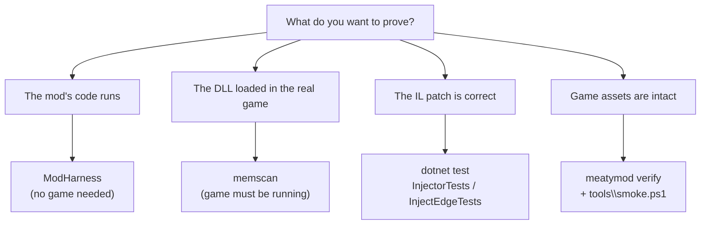

# Tools & scripts

Two standalone QA tools plus the scripts that glue the build, launch and release workflows together.

| Tool | Answers |
| --- | --- |
| [ModHarness](./modharness.md) | "does the mod's `Inject` code actually execute?" — without launching the game |
| [memscan](./memscan.md) | "did the DLL really load into the running game, and did it write its marker?" |

```bat
dotnet build tools\modharness\ModHarness.csproj -c Release
:: → tools\modharness\bin\Release\net10.0-windows\ModHarness.exe

dotnet build tools\memscan\MemScan.csproj -c Release
:: → tools\memscan\bin\Release\net10.0\memscan.exe
```

Both are built by `all.bat`.

## Repository scripts

### Build

| Script | What it does |
| --- | --- |
| `all.bat` | Release-builds the `src` solution, `tools\modharness`, `tools\memscan`, `mods\Oink`, `mods\QuackMenu` — stops at the first failure with a `[all] … FAILED.` line and exit code `1` |
| `mods\Oink\build.bat` | `dotnet build mods\Oink\src\Oink\Oink.csproj -c Release` |
| `mods\QuackMenu\build.bat` | same for QuackMenu |

### Run a modded session

| Script | Builds first? | Mods |
| --- | --- | --- |
| `mods\Oink\run.bat` | ✅ | Oink |
| `mods\QuackMenu\run.bat` | ✅ | QuackMenu |
| `mods\launch\launch-oink.bat` | ❌ | Oink |
| `mods\launch\launch-quackmenu.bat` | ❌ | QuackMenu |
| `mods\launch\launch-both.bat` | ❌ | Oink **and** QuackMenu |

They all follow the same safe sequence:

```text
[restore the exe]  →  inject  →  start the game and wait  →  [restore the exe]
```

…so the executable is never left patched, even if the previous run crashed. Each script picks whichever `meatymod.exe` is **newer** between `bin\Release\net10.0` and `bin\Debug\net10.0`, and fails early with a helpful message if the game executable, the mod DLL or `meatymod.exe` is missing.

`mods\launch\readme.txt`, in full: *"batchfile scripts for people who are lazy to load them manually"*.

### Release

`tools\release.ps1` — build, stage, hash and zip a distributable.

```powershell
powershell -ExecutionPolicy Bypass -File tools\release.ps1
```

Stages:

1. `dotnet build src\MeatyMod.sln -c Release`;
2. read the version out of `src\MeatyMod.Core\VersionInfo.cs` with a regex;
3. stage `meatymod.exe`, `meatymod.dll`, `meatymod.runtimeconfig.json`, `meatymod.deps.json` plus `Mono.Cecil` under `lib\`;
4. pack the example mods with `meatymod pack`;
5. copy `README.md` and `THIRD_PARTY_NOTICES.md`;
6. write `SHA256SUMS.txt` — `<hash>  <relative path>`, ASCII, sorted by full path;
7. `Compress-Archive` → `dist\meatymod-<version>.zip`;
8. print a summary; the staging directory is removed in a `finally` block.

Errors set exit code `1`. Note that `SHA256SUMS.txt` puts the **hash first**, the opposite column order from `pack`'s `checksums.txt`.

:::caution Hard-coded staging path
`$StagingBase` points at a developer-specific `%LOCALAPPDATA%\Temp\opencode\meatymod-release` path. Change it (or make it `$env:TEMP`-relative) before running the script on another machine.
:::

### Smoke test

`tools\smoke.ps1` — post-install verification against a real game copy.

```powershell
powershell -ExecutionPolicy Bypass -File tools\smoke.ps1
```

It builds the CLI in Debug and then asserts, among others:

| Assertion | Expected |
| --- | --- |
| `meatymod verify "game\Blood and Bacon"` | exit `0`, `Valid: 1860`, `Invalid: 0` |
| `meatymod manifest <Content> <tmp.json>` | exit `0`, 1353 unique basenames |
| `astro\brushes\earth.raw`, `earth2.raw` | 8,000,000 bytes each (2000 × 2000 `ushort`) |
| `*.wmv` under the game folder | 4 files |
| `*.xnb` under `Content\` | 1396 files |

Output is `SMOKE PASS` (exit `0`) or `SMOKE FAIL <reasons joined by ';'>` (exit `1`).

:::note The numbers are install-specific
Those counts describe the game build the suite was developed against. After a game patch, re-baseline them rather than treating a mismatch as a MeatyMod bug — `.ai/maintenance/GAME_UPDATES.MD` is where the project tracks that.
:::

## Choosing a verification tool


